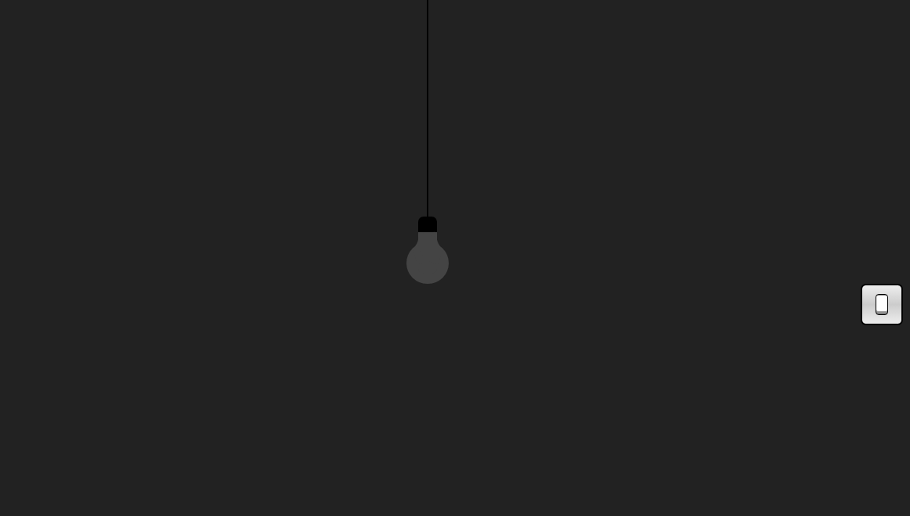

# Lâmpada no css

<h3 align="center"> Uma lâmpada feita com CSS e JS </h3>

# Layout

 Dísponivel para desktop e mobile. 

<h1>  </h1>

# Linguagens

- HTML  
- CSS  
- JS

made by <a href="https://www.instagram.com/julius__caezar/">julius caezar </a>
